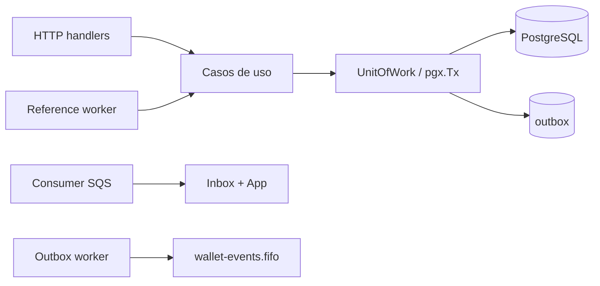

# Arquitetura — jungle-wallet-go

Fonte de requisitos: [`docs/CHALLENGE.md`](docs/CHALLENGE.md). Evidência por item: [`docs/REQUIREMENTS-TRACE.md`](docs/REQUIREMENTS-TRACE.md).

## Visão geral

Um processo Go (Uber Fx) expõe HTTP e três workers: consumidor SQS de apostas, publisher de outbox e resolvedor de referências pendentes. O domínio (`internal/domain`) não importa Fx, HTTP, SQS nem pgx. Casos de uso em `internal/app` orquestram ports; Postgres e SQS implementam essas ports em `internal/infra`.

## Dinheiro

`Money` (`internal/domain/money`) é value object imutável: `int64` em unidades mínimas + moeda ISO 4217 (`CHAR(3)` no banco, `BIGINT` para o valor).

- Parsing manual de string decimal (`strings` + `strconv.ParseInt`). Nenhum caminho monetário usa `float32`/`float64` (também reforçado por `forbidigo` no lint em domínio e postgres).
- Aceita 0, 1 ou 2 casas; normaliza para centavos **antes** do hash de idempotência. Rejeita 3+ casas, vazio, `NaN`, `Infinity`, notação científica, sinal explícito e espaços. Não arredonda entrada inválida.
- Saída externa sempre com 2 casas (`25.00`). Overflow tratado em `Parse`, `Add`, `Sub` e `Neg`.
- Limite documentado: ≈ ±92,2 quatrilhões de unidades mínimas (`int64`).

## Persistência e delimitação da transação SQL

Biblioteca: **pgx/v5** + `pgxpool`, SQL explícito. Sem ORM/sqlc — locks, constraints e `BEGIN`/`COMMIT` ficam auditáveis.

`UnitOfWork` (`internal/infra/postgres`) abre a transação no caso de uso e passa o mesmo `pgx.Tx` a todos os repositórios. Repositório nenhum chama `Begin`. No caminho SQS, inbox e domínio compartilham essa transação; `DeleteMessage` só ocorre após o commit.

Reconciliação usa `WithinRepeatableRead`: lê saldo e ledger na mesma snapshot, sem escrita.

## Idempotência

SHA-256 sobre JSON canônico (chaves ordenadas, sem espaços, sem nulos, UTF-8) dos campos de negócio: `providerId`, `externalTransactionId`, `playerId`, `walletId`, `roundId`, `gameId`, `kind`, `money.amount` já em unidades mínimas, `money.currency` em maiúsculas, e `referenceExternalTransactionId` quando presente. Fora do hash: header `Idempotency-Key` e metadados de transporte.

A mesma função (`wagering.CanonicalHash`) serve HTTP e SQS. Resolução da chave: `INSERT ... ON CONFLICT DO NOTHING` (corrida bloqueia até o commit do vencedor); depois compara hash — mesmo hash → replay com snapshot de saldo original; hash diferente → 409. `(providerId, externalTransactionId)` com outra chave também conflita. Snapshot de saldo resultante é persistido na transação para o replay devolver o saldo observado no processamento original.

Estado durável não terminal: apenas `PENDING_REFERENCE`. `BET`/`WIN`/`LOSS` sem dependência concluem em um único commit (`PENDING` só em memória dentro da tx).

## Locks e concorrência

Por carteira: `SELECT ... FOR UPDATE` + `UPDATE ... WHERE id = $1 AND version = $2`. Sem lock global. Carteiras distintas não se bloqueiam (demonstrado em `test/cluster`).

Invariantes no schema (não dependem de memória de processo): `CHECK (balance_minor >= 0)`, uniques de carteira/transação/ledger/inbox, índice parcial de uma reversão processada por referência, trigger append-only no ledger + role sem `UPDATE`/`DELETE`, um `OPENING` por carteira.

## Máquina de estados e falhas

Estados: `PENDING` → `PENDING_REFERENCE` | `PROCESSED` | `REJECTED` | `FAILED`. Terminais não transitam; replay lê resultado persistido.

- **Transitória**: erro de infra (Postgres/SQS), mensagem reaparece por visibility timeout / retry SQS, outbox com backoff.
- **Permanente / negócio**: `REJECTED` com `failureCode` estável; mensagem SQS pode ser apagada após commit.
- Referência ainda em `PENDING_REFERENCE`: a operação dependente permanece aguardando (worker tenta de novo), não é rejeição imediata.

### Códigos de falha

| Código | Situação |
| --- | --- |
| `INSUFFICIENT_FUNDS` | `BET` sem saldo |
| `REVERSAL_INSUFFICIENT_FUNDS` | `ROLLBACK` que deixaria saldo negativo |
| `REFERENCE_NOT_FOUND` | TTL/tentativas esgotadas |
| `REFERENCE_ALREADY_REVERSED` | aposta já desfeita (qualquer tipo) |
| `REFERENCE_NOT_PROCESSED` | referência `REJECTED`/`FAILED` |
| `REFERENCE_MISMATCH` | provedor/jogador/carteira/moeda/rodada |
| `REFERENCE_AMOUNT_MISMATCH` | valor diferente do referenciado |
| `REFERENCE_NOT_REVERSIBLE` | `LOSS` / `OPENING` / outra reversão |
| `CURRENCY_MISMATCH` | moeda ≠ carteira |
| `INVALID_AMOUNT` | zero onde exige positivo, ou ≠ 0 em `LOSS` |
| `KIND_NOT_ALLOWED` | `OPENING` via HTTP/SQS |
| `WALLET_NOT_FOUND` / `PLAYER_WALLET_MISMATCH` | carteira ausente ou de outro jogador |

### HTTP (RFC 7807)

| Status | Quando |
| --- | --- |
| 201 | carteira aberta |
| 200 | processado ou replay |
| 202 | `PENDING_REFERENCE` |
| 400 | entrada inválida |
| 401 / 403 | credencial / provider ou role |
| 404 | recurso inexistente ou de outro provedor |
| 409 | conflito de chave/payload/carteira |
| 422 | rejeição de negócio (`failureCode`) |
| 503 | Postgres/SQS transitório (`Retry-After` quando aplicável) |

## Referências pendentes e reversões

`REFUND`/`ROLLBACK` exigem `referenceExternalTransactionId` resolvido por `(providerId, …)`. Conferência de provedor, jogador, carteira, moeda, rodada e valor integral.

Política de reversão: **uma única reversão bem-sucedida por aposta**, seja `REFUND` ou `ROLLBACK` — índice único parcial em `reference_transaction_id WHERE status = 'PROCESSED'`. Segunda tentativa → `REFERENCE_ALREADY_REVERSED`. Mais restritivo que “duas do mesmo tipo”; evita devolução duplicada do mesmo débito.

Worker de referência: backoff, `next_attempt_at`, máximo de tentativas e TTL (defaults no caso de uso). Esgotado → `REJECTED` + `REFERENCE_NOT_FOUND` + evento de rejeição.

## Inbox e outbox

- **Inbox**: `UNIQUE (consumer_name, message_id)` na mesma tx do domínio. `DeleteMessage` só pós-commit. Malformada → caminho para DLQ sem reprocessar domínio.
- **Outbox**: registros no mesmo commit; worker separado com `FOR UPDATE SKIP LOCKED` + `locked_until`, backoff e retomada. Republicação preserva `eventId` (= `MessageDeduplicationId` da fila de eventos).

Eventos tipados: `WagerTransactionProcessed`, `WagerTransactionRejected`, `WalletBalanceChanged`, `WagerTransactionPendingReference`. Envelope com `eventId`, `eventType`, `aggregateId`, `correlationId`, `causationId` opcional, `occurredAt`, `version`, `data`.

## Autenticação e autorização

Keycloak no Compose com realm importado. Validação JWT via JWKS (`coreos/go-oidc`). `providerId` do corpo conferido com claim do token (divergência → 403 antes de escrita). Isolamento entre provedores em leitura e replay. `POST /wallets`, `GET /wallets/{id}`, `GET /wallets/{id}/ledger` e reconciliação exigem `wallet:admin` (`RequireInternal`). Mensageria: filas FIFO com atributo `Policy` (política de recurso da fila) no LocalStack; users/policies IAM também são criados no `init-sqs.sh`, mas o LocalStack **não aplica** IAM sem `ENFORCE_IAM` — no ambiente local essas policies de usuário são declarativas. O domínio continua validando no consumidor.

## Fx e shutdown

Módulos por camada (`fx.Module` / `Provide` / `Invoke`). `fx.Lifecycle`: validação na subida; workers cancelados por `context`; no `SIGTERM`, consumer para de buscar, drena in-flight ou libera visibility; pool Postgres fecha depois dos componentes que o usam. Timeout configurável (`SHUTDOWN_TIMEOUT`).

## Observabilidade

Logs JSON (`slog`) com `correlationId`, `messageId`, `transactionId`, `walletId`, `providerId` — sem credenciais nem payload financeiro completo. Prometheus em `/metrics`: status, duplicatas, retries, DLQ, conflitos, lag de outbox, latência, divergências de reconciliação. `/health/live` e `/health/ready` (Postgres + SQS).

## Ordem de lock na aposta

No processamento de aposta, a chave de idempotência é consultada com `SELECT` antes de qualquer escrita. Operação nova: `SELECT … FOR UPDATE` na carteira e só então `INSERT` da chave. Isso evita deadlock clássico: dois `INSERT` em `wager_transactions` pegavam `FOR KEY SHARE` na carteira e depois pediam `FOR UPDATE` um ao outro. Deadlock (`40P01`) / serialization failure (`40001`) no UoW ainda entram em retry limitado e, esgotado, viram `ErrTransient` → 503.

## Consumidor SQS e reconciliação

O consumer agrupa o lote por `MessageGroupId` e processa um grupo por goroutine (FIFO por carteira). Reconciliação soma o ledger no banco (`SUM`), sem truncar a leitura em memória.

## Smoke HTTP (Postman)

Além de `docs/examples/curl.md`, a collection [`docs/examples/jungle-wallet.postman_collection.json`](docs/examples/jungle-wallet.postman_collection.json) (environment local ao lado) cobre o fluxo autenticado ponta a ponta — tokens, abertura, BET/WIN/LOSS, replay, conflito, REFUND + ROLLBACK de REFUND, pendência de referência, leituras, authz e reconciliação — com asserção por request. `newman run` no README.

Carga reprodutível (p50/p95/p99 + snapshot Prometheus): [`docs/loadtest.md`](docs/loadtest.md) (`make loadtest`).

## Limitações e interpretações

- Não implementados (opcionais do enunciado): OpenTelemetry tracing, ledger de partidas dobradas.
- `PENDING` intermediário assíncrono não é persistido; retomação durável cobre `PENDING_REFERENCE` e outbox/inbox.
- Escala monetária fixa em 2 casas (adequado a BRL nos cenários; tipo carrega moeda e rejeita incompatibilidade).
- Clients/segredos do Keycloak e LocalStack são apenas para ambiente local (`.env.example`).
- LocalStack sem `ENFORCE_IAM`: policies IAM de usuário no `init-sqs.sh` são declarativas; a política efetiva local é o atributo `Policy` das filas.
- Integração pode usar testcontainers ou fallback `USE_COMPOSE=1` apontando ao stack já provisionado — infraestrutura real, sem mock total de PG/SQS/IdP.
- `GET /wallets/{id}` e `GET /wallets/{id}/ledger` são só `wallet:admin` (mesmo gate de `POST /wallets` e reconciliação), não `wagering:read`.
- Com `USE_COMPOSE=1`, `TestMigrations_UpDownUp` é skipped (migrate down dropa `wallet_app` e quebraria a API compartilhada); o teste roda sob testcontainers.
- Compose: API depende de Keycloak `service_healthy` (realm importado). `scripts/bootstrap.sh` ainda força `up` da API após o realm responder, para clones limpos.
