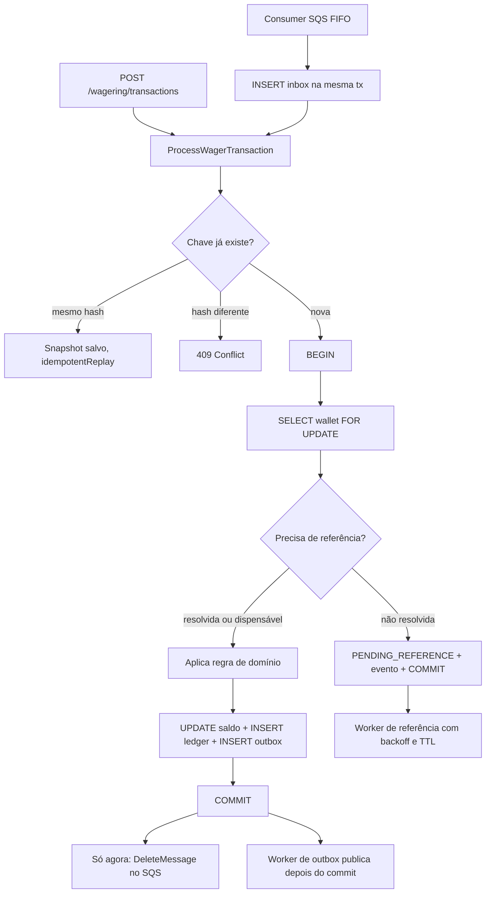
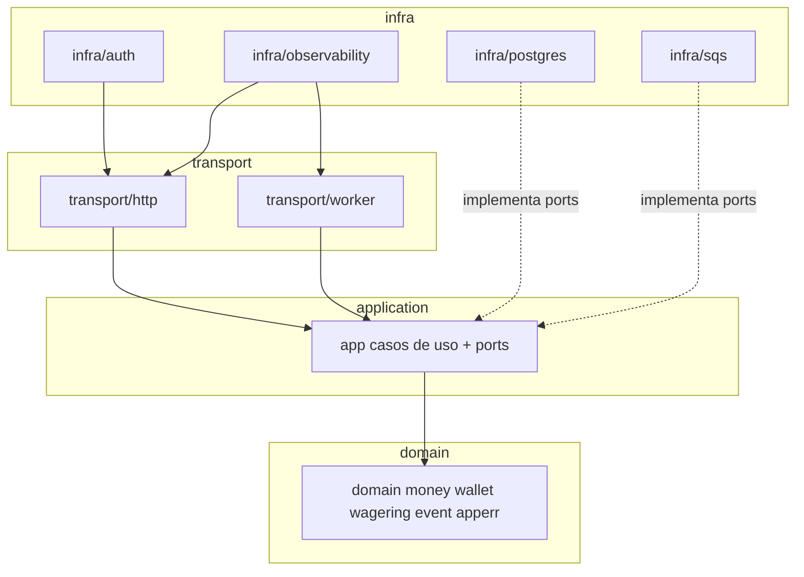
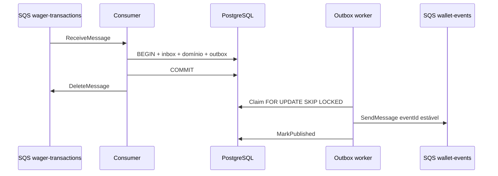
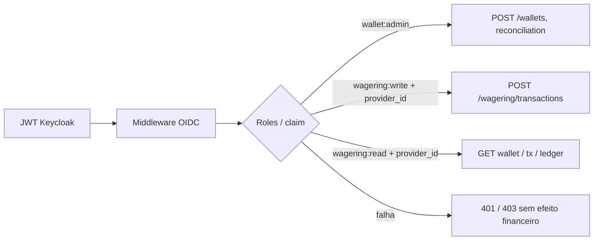

# Diagramas

## Fluxo de processamento (HTTP / SQS → commit → outbox)

```mermaid
flowchart TD
  HTTP["POST /wagering/transactions"] --> UC
  SQSIn["Consumer SQS FIFO"] --> InboxIns["INSERT inbox na mesma tx"]
  InboxIns --> UC["ProcessWagerTransaction"]
  UC --> Hash{"Chave já existe?"}
  Hash -->|"mesmo hash"| Replay["Snapshot salvo, idempotentReplay"]
  Hash -->|"hash diferente"| Conflict["409 Conflict"]
  Hash -->|"nova"| Tx["BEGIN"]
  Tx --> Lock["SELECT wallet FOR UPDATE"]
  Lock --> Ref{"Precisa de referência?"}
  Ref -->|"não resolvida"| Pend["PENDING_REFERENCE + evento + COMMIT"]
  Ref -->|"resolvida ou dispensável"| Apply["Aplica regra de domínio"]
  Apply --> Write["UPDATE saldo + INSERT ledger + INSERT outbox"]
  Write --> Commit["COMMIT"]
  Commit --> DelMsg["Só agora: DeleteMessage no SQS"]
  Commit --> Pub["Worker de outbox publica depois do commit"]
  Pend --> RefWorker["Worker de referência com backoff e TTL"]
```

## Camadas de pacotes

```mermaid
flowchart TB
  subgraph transport
    HTTP[transport/http]
    Workers[transport/worker]
  end
  subgraph application
    App[app casos de uso + ports]
  end
  subgraph domain
    Dom[domain money wallet wagering event apperr]
  end
  subgraph infra
    PG[infra/postgres]
    SQS[infra/sqs]
    Auth[infra/auth]
    Obs[infra/observability]
  end
  HTTP --> App
  Workers --> App
  App --> Dom
  PG -. implementa ports .-> App
  SQS -. implementa ports .-> App
  Auth --> HTTP
  Obs --> HTTP
  Obs --> Workers
```

## Inbox / outbox e falhas

```mermaid
sequenceDiagram
  participant SQS as SQS wager-transactions
  participant Cons as Consumer
  participant DB as PostgreSQL
  participant Out as Outbox worker
  participant Ev as SQS wallet-events

  SQS->>Cons: ReceiveMessage
  Cons->>DB: BEGIN + inbox + domínio + outbox
  Cons->>DB: COMMIT
  Cons->>SQS: DeleteMessage
  Out->>DB: Claim FOR UPDATE SKIP LOCKED
  Out->>Ev: SendMessage eventId estável
  Out->>DB: MarkPublished
```

## Authz por rota

```mermaid
flowchart LR
  Token[JWT Keycloak] --> MW[Middleware OIDC]
  MW --> Roles{Roles / claim}
  Roles -->|wallet:admin| Internal["POST /wallets, reconciliation"]
  Roles -->|wagering:write + provider_id| Write["POST /wagering/transactions"]
  Roles -->|wagering:read + provider_id| Read["GET wallet / tx / ledger"]
  Roles -->|falha| Deny["401 / 403 sem efeito financeiro"]
```
